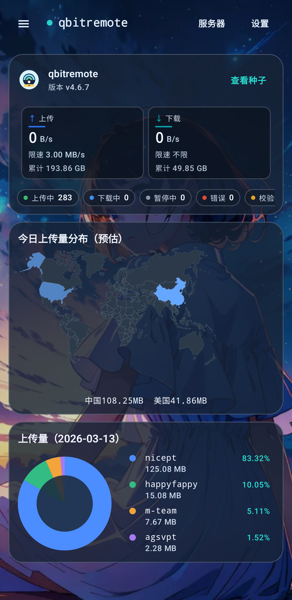
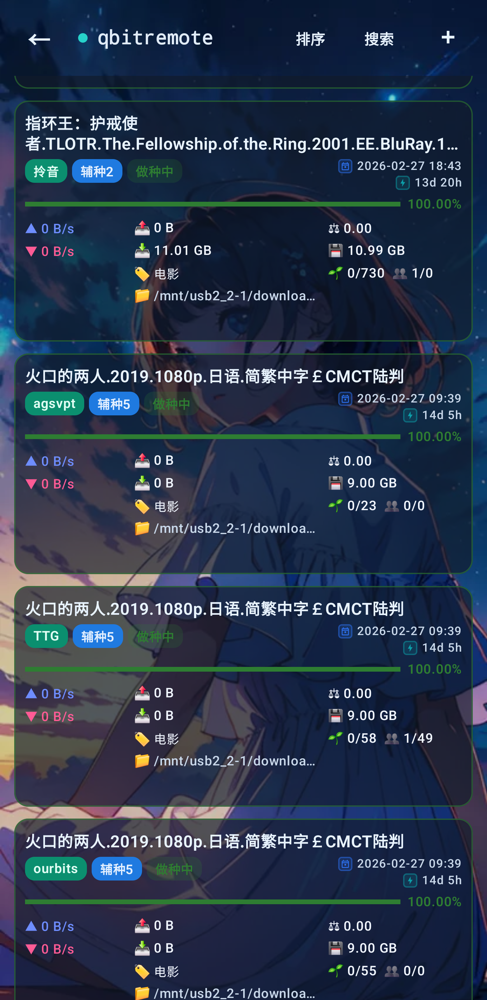

  

<h1 align="center">qbitremote</h1>

  面向 Android 的 qBittorrent 远程管理应用，专注高频操作、可视化仪表盘和更顺手的移动端体验。 
  A polished Android remote for qBittorrent focused on fast daily control, clear dashboards, and a modern mobile workflow.

  
  
  
  

## 项目简介 / Overview

qbitremote 是一个基于 Android 的 qBittorrent WebUI 远程管理客户端，围绕日常管理效率、状态可视化和更完整的移动端交互来设计。  
qbitremote is an Android client for qBittorrent WebUI, designed around fast daily management, readable stats, and a more complete mobile UI.

- 支持多服务器配置，适合同时管理家用设备、NAS 或 seedbox。  
  Save multiple server profiles and switch between home boxes, NAS devices, or seedboxes.
- 首页提供实时上传下载、状态统计、图表和上传分布视图。  
  The home screen surfaces real-time transfer stats, status counts, charts, and upload distribution views.
- 提供统一种子列表，支持搜索、排序、批量浏览与详情操作。  
  A unified torrent list makes searching, sorting, browsing, and detail actions much easier on mobile.
- 支持自定义主题与背景图片，让远程管理界面更个性化。  
  Custom themes and background images make the remote experience feel more personal.

## 界面预览 / Screenshots

<table>
  <tr>
    <td align="center" width="50%">
      
    </td>
    <td align="center" width="50%">
      
    </td>
  </tr>
  <tr>
    <td align="center"><strong>仪表盘 / Dashboard</strong></td>
    <td align="center"><strong>种子列表 / Torrent List</strong></td>
  </tr>
</table>

## 核心功能 / Core Features

### 服务器配置 / Server Profiles

- 保存多个 qBittorrent 服务器，快速切换不同环境。  
  Save multiple qBittorrent servers and jump between environments quickly.
- 支持主机、IP 或完整 `http(s)` 地址连接。  
  Connect with a host, IP address, or full `http(s)` endpoint.
- 连接信息本地保存，适合长期管理固定节点。  
  Connection profiles are stored locally for repeat daily use.

### 仪表盘 / Dashboard

- 实时查看上传、下载、累计流量和限速状态。  
  Monitor upload, download, totals, and rate limits in real time.
- 查看上传中、下载中、暂停、校验、错误等状态统计。  
  Track uploading, downloading, paused, checking, and error states at a glance.
- 通过图表卡片和上传分布更直观地理解当前活动。  
  Chart cards and upload distribution views make current activity easier to read.

### 种子管理 / Torrent Management

- 统一种子列表，支持搜索、排序和更高效的浏览。  
  Browse everything in one torrent list with search and flexible sorting.
- 支持查看进度、速度、分类、标签、保存路径和做种信息。  
  Check progress, speeds, categories, tags, save paths, and seeding status from the list.
- 首页卡片支持拖动排序，常用信息可以按自己的习惯摆放。  
  Home cards can be reordered so the dashboard matches your workflow.

### 添加与详情操作 / Add & Detail Actions

- 支持磁力链接、URL 和 `.torrent` 文件添加任务。  
  Add new tasks from magnet links, URLs, or `.torrent` files.
- 支持暂停、恢复、删除、改名以及分类和标签调整。  
  Pause, resume, delete, rename, and update categories or tags.
- 详情页可查看信息、Tracker、Peers、Files 等关键数据。  
  Detail views cover info, trackers, peers, files, and other key data.

## 界面亮点 / UI Highlights

- 自定义主题与图片背景：可以用系统图片选择器设置个性化背景。  
  Custom themes and image backgrounds let you personalize the app with the system photo picker.
- 玻璃态卡片风格：核心卡片、弹窗和列表在自定义主题下更统一。  
  A glass-style presentation keeps cards, sheets, and panels visually consistent.
- 图表与上传分布：更适合快速看状态，而不是只看纯文本数字。  
  Charts and upload distribution panels help you understand activity faster than raw numbers alone.
- 搜索、排序与拖动排序：围绕高频使用场景做了移动端优化。  
  Search, sorting, and drag reordering are tuned for frequent mobile use.

## 下载 / Download

- GitHub Releases: [smhjw/qbitremote releases](https://github.com/smhjw/qbitremote/releases)
- APK: 适合直接安装体验最新版。  
  APK: best for direct install and quick testing.
- AAB: 适合 Google Play 发布与更新。  
  AAB: intended for Google Play publishing and updates.

## 许可证 / License

See [LICENSE](LICENSE).
